# ApiRestFul 

Essa é uma api criada com SpringBoot, utilizando o modelo de maturidade de Richardson, seguindo todos os requisitos.

****

## Ferramentas utilizadas
- Java, SpringBoot, SpringWeb, Spring Hateoas, Spring Data, PostreSQL. 
- Intellij, Insomnia.

## Padrão de Richardson
A Maturidade de Richardson é aplicada para dizer que uma Api é restful, sendo assim é preciso seguir algumas regras
para que esse método seja aplicado corretamente.

Um pouco mais sobre A Maturidade de Richardson no link: https://rivaildojunior.medium.com/modelo-de-maturidade-de-richardson-para-apis-rest-8845f93b288

## Sobre o projeto

Esse projeto é uma Api Restful que está salvando uma todoList no banco levando em conta toda a maturidade de Richardson. o intuito é realizar um CRUD no banco onde iremos salvar e recuperar esses dados da maneira correta.
****

# Minhas configurações iniciais

Para iniciar o projeto utilizei o Spring Initializer, com as configurações que estão na imagem abaixo.

 
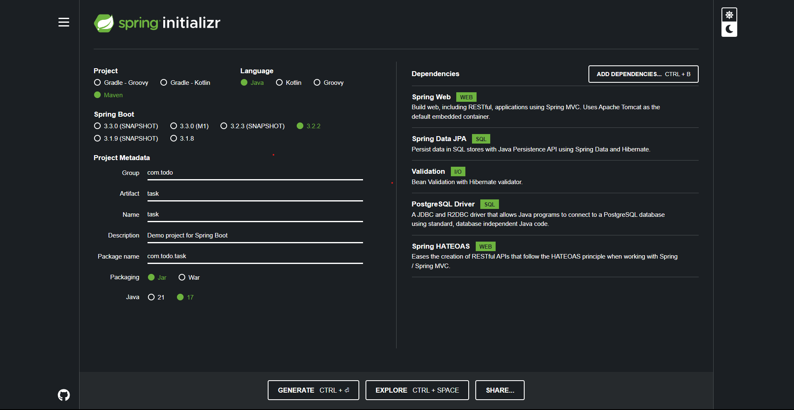

- Utilizei as dependências SpringWeb, SpringDataJpa, Validation, PostgreSQL_Driver, Spring HATEOAS.

Após iniciar o projeto na IDE realizei a criação dos pacotes, como na imagem abaixo.

 
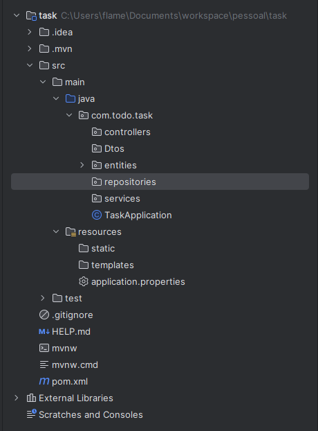

- Utilizei um padrão de pacotes bem próximo com o padrão MVC.

Depois de criar todas as classes e colocar nos seus pacotes, denominei todas as rotas como "todos", ficando "localhost:8080/todos", como podem ver utilizei 3 dos padrões de richardson nesse modelo, faltando somente adicionar o último para tornar a api restful.

 

## Adicionando o Hateoas

Para que minha aplicação se torne Restful, estava faltando somente as Hipermídias, sendo assim utilizei a biblioteca Spring HATEOAS, para adicionar todas as Hipermídias, no final a resposta da aplicação ficou como na imagem abaixo.

 
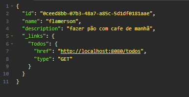

## Como utilizar o projeto

**Configuração**

É preciso alterar o documento application.properties que está dentro do diretório, src/main/resources.

 
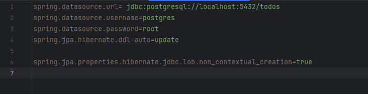
 

Nele temos 5 linhas precisando alterar somente as linhas de acordo com seu banco.

Após isso é preciso entrar no diretório pom.xml e utilizar a sua IDE para baixar as External Libraries do projeto, aqui teremos todas as dependências.

**Rotas da aplicação**

A aplicação está na rota "http://localhost:8080/todos",  No Modelo de Richardson só precisamos alterar o verbo Http da aplicação para assim conseguirmos seguir todo o fluxo da API.

**Post** :

A rota post recebe um objeto no formato Json, esse objeto precisa ter os seguintes parâmetros, name e descrição, ambos no formato string.

 
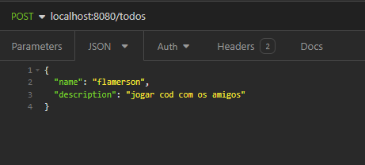

- A resposta esperada é o elemento cadastrado no banco com seu ID e uma rota que leva para a listagem geral.

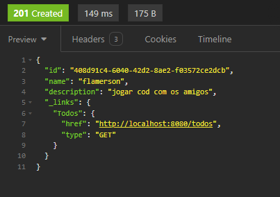

**Get** :

Temos duas rotas, uma que trás um único resultado e outra que lista todos os resultados. Na rota que traz todos os resultados não precisamos passar nenhum parâmetro extra somente a rota e o Verbo Http correto. 
Já na segunda rota, temos somente um elemento do banco selecionado, temos que passar o parâmetro ID na URL da nossa API, assim retornando apenas um elemento da nossa lista.

 
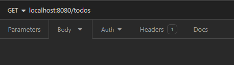
 

- A resposta esperada aqui é uma lista com todos os objetos do banco.

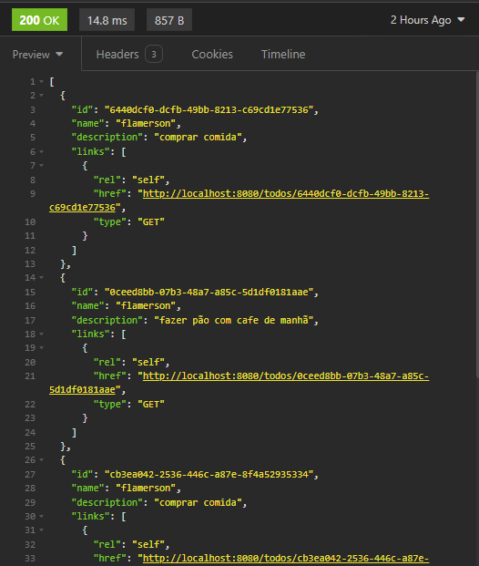

 

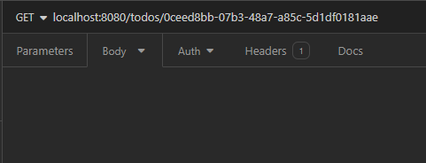
 

- A resposta esperada aqui é um objeto com todos os seus dados e uma rota para a listagem geral.

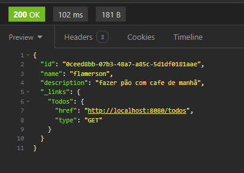

**Put**

Na rota Put, devemos passar dois parâmetros antes de atualizar. Precisamos passar o ID do elemento na URL, e o que precisa ser atualizado no corpo da requisição.

 
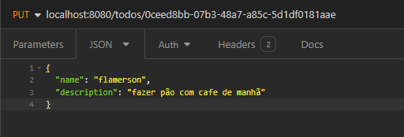

- A resposta esperada aqui é um objeto com todos os seus dados e uma rota para a listagem geral.

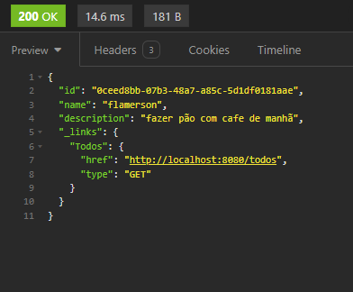

**Delete**

Na rota delete, devemos passar apenas um argumento que é o Id na URL da requisição e o elemento será deleteda do banco.

 
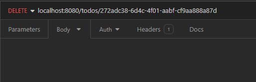

- A resposta esperada aqui é uma mensagem informando que o objeto foi deletado com sucesso.

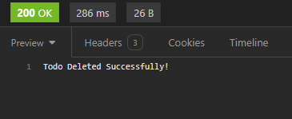

## Resumo Final

Eu aprendi bastante sobre Hateoas e como funciona para uma API ser restful, utilizando a Maturidade de Richardson. O projeto é simples, mas trago todos os pontos estudados e reforçá los ao longo do tempo mesmo na simplicidade é ótimo para não esquecer. 
